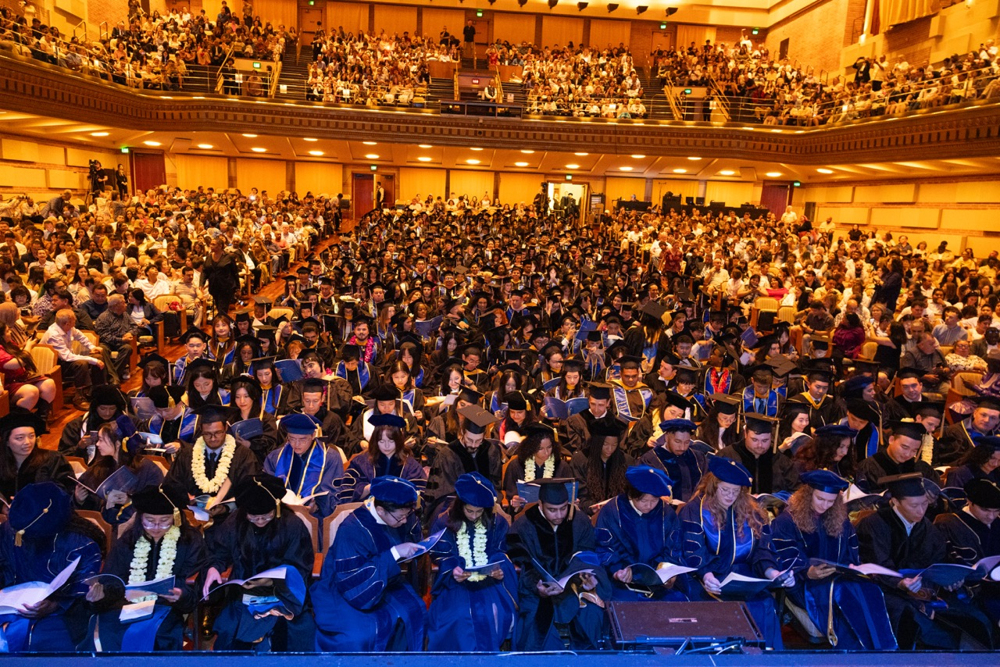
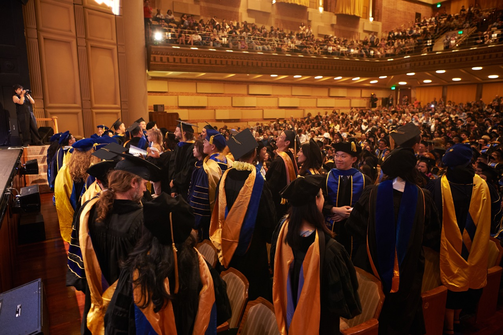
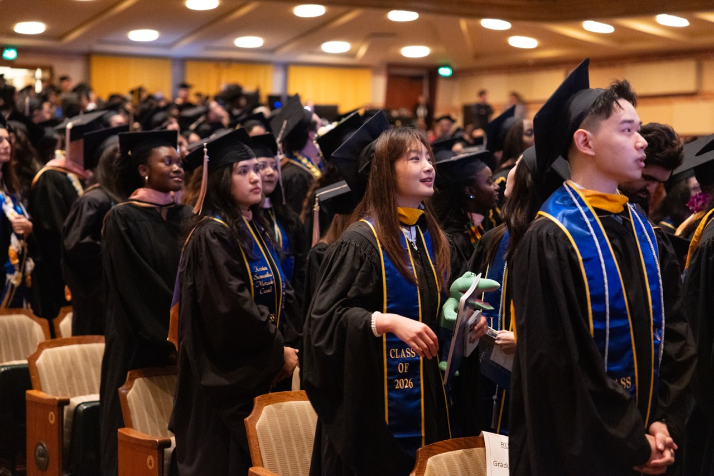
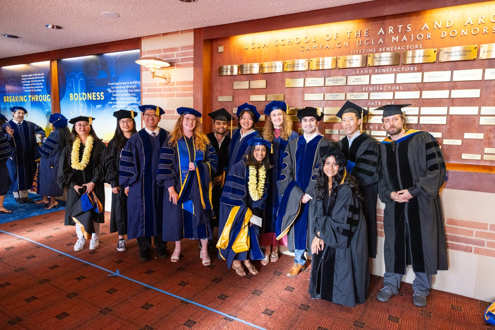

```{=html}
<style>
.quarto-title-block, h1.title { display: none !important; }
</style>
```

```{=html}
<!-- ── Alumni banner — full-bleed, darkened. EDITABLE: swap the 
     below for any other photo in ../images/directory/alumni/. -->
<div class="page-hero alumni-banner">
  
  <div class="alumni-banner-title">Alumni Directory</div>
</div>

<div class="alumni-landing">

  <a href="directory.html" class="btn btn-outline-primary alumni-back-link">&larr; Student Directory</a>

  <p class="alumni-intro-desc">
    Meet our alumni! This directory started collecting in 2026, it will grow
    as more cohorts graduate.
  </p>

  <!-- ── Program rows — image + overlapping color-block text, alternating
       sides. EDITABLE: swap each  and the copy in each box. -->
  <section class="alumni-program-rows">

    <div class="alumni-program-row">
      <div class="alumni-program-image">
        
      </div>
      <div class="alumni-program-box">
        <div class="alumni-program-box-title">MS Alumni</div>
        <p class="alumni-program-box-desc">Meet the Alumni for Master of Science (Starting with class of 2026)</p>
        <a href="ms-alumni.html" class="btn btn-lg btn-pill">Explore &rarr;</a>
      </div>
    </div>

    <div class="alumni-program-row alumni-program-row-reverse">
      <div class="alumni-program-image">
        
      </div>
      <div class="alumni-program-box alumni-program-box-gold">
        <div class="alumni-program-box-title">MDSH Alumni</div>
        <p class="alumni-program-box-desc">Meet the Alumni for Master of Data Science in Health (Starting with class of 2026)</p>
        <a href="mdsh-alumni.html" class="btn btn-lg btn-pill">Explore &rarr;</a>
      </div>
    </div>

    <div class="alumni-program-row">
      <div class="alumni-program-image">
        
      </div>
      <div class="alumni-program-box">
        <div class="alumni-program-box-title">PhD Alumni</div>
        <p class="alumni-program-box-desc">Meet the Alumni for Doctor of Philosophy (Starting with class of 2026)</p>
        <a href="phd-alumni.html" class="btn btn-lg btn-pill">Explore &rarr;</a>
      </div>
    </div>

  </section>

</div>
```
