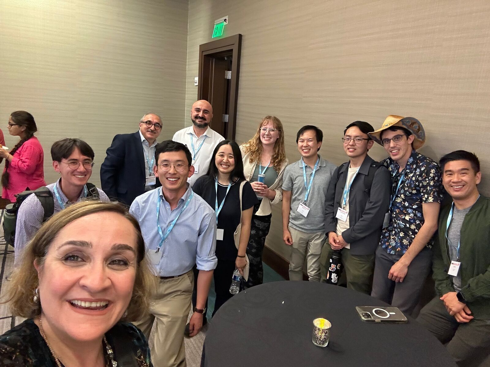
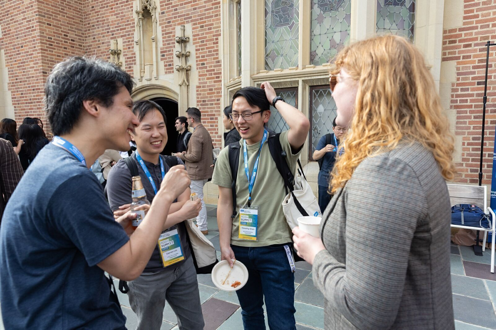
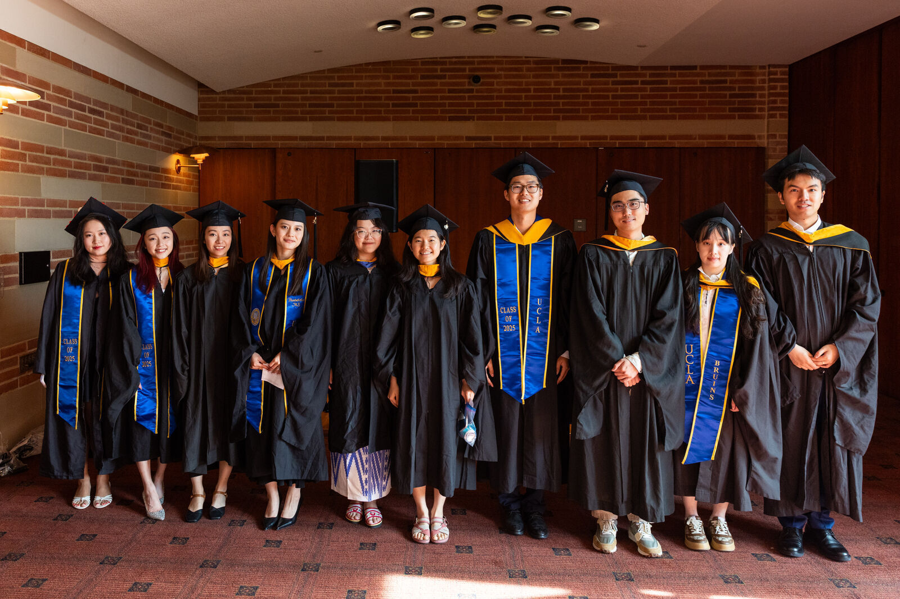

```{=html}
<div class="directory-landing">

  <!-- Hero section: text left, photo right -->
  <div class="directory-hero">
    <div class="directory-hero-text">
      <h2 class="directory-hero-title">The Students</h2>
      <p class="directory-hero-desc">
        Meet the students of UCLA Biostatistics! Our community spans three
        graduate programs: the <strong>Master of Science in Biostatistics</strong>,
        the <strong>Master of Data Science in Health (MDSH)</strong>, and the
        <strong>Doctor of Philosophy in Biostatistics</strong>. 
      </p>
    </div>
    <div class="directory-hero-photo">
      <div class="slideshow-container">
        
        <div class="slide active">
          
        </div>
        <div class="slide">
          
        </div>
        <div class="slide">
          
        </div>
        <div class="slide">
          
        </div>
        
        <button class="slide-btn slide-prev" onclick="changeSlide(-1)">&#10094;</button>
        <button class="slide-btn slide-next" onclick="changeSlide(1)">&#10095;</button>
        
        <div class="slideshow-dots">
          <span class="dot active" onclick="goToSlide(0)"></span>
          <span class="dot" onclick="goToSlide(1)"></span>
          <span class="dot" onclick="goToSlide(2)"></span>
          <span class="dot" onclick="goToSlide(3)"></span>
        </div>

      </div> </div>
  </div>

  <!-- Program cards -->
  <!-- Current Students -->
  <h3 style="margin-bottom: 1rem; color: #003B5C;">Current Students</h3>
  <div class="program-cards-grid">
    <a href="phd-students.html" class="text-decoration-none">
      <div class="directory-program-card">
        
        <div class="card-body text-center">
          <h3 class="card-title mt-2">PhD Students</h3>
        </div>
      </div>
    </a>
    <a href="ms-students.html" class="text-decoration-none">
      <div class="directory-program-card">
        
        <div class="card-body text-center">
          <h3 class="card-title mt-2">MS Students</h3>
        </div>
      </div>
    </a>
    <a href="mdsh-students.html" class="text-decoration-none">
      <div class="directory-program-card">
        
        <div class="card-body text-center">
          <h3 class="card-title mt-2">MDSH Students</h3>
        </div>
      </div>
    </a>
  </div>

  <!-- Alumni -->
  <!-- <h3 style="margin-top: 2.5rem; margin-bottom: 1rem; color: #003B5C;">Alumni</h3> -->
  <!-- <div class="program-cards-grid"> -->
  <!--   <a href="phd-alumni.html" class="text-decoration-none"> -->
  <!--     <div class="directory-program-card"> -->
  <!--        -->
  <!--       <div class="card-body text-center"> -->
  <!--         <h3 class="card-title mt-2">PhD Alumni</h3> -->
  <!--       </div> -->
  <!--     </div> -->
  <!--   </a> -->
  <!--   <a href="ms-alumni.html" class="text-decoration-none"> -->
  <!--     <div class="directory-program-card"> -->
  <!--        -->
  <!--       <div class="card-body text-center"> -->
  <!--         <h3 class="card-title mt-2">MS Alumni</h3> -->
  <!--       </div> -->
  <!--     </div> -->
  <!--   </a> -->
  <!--   <a href="mdsh-alumni.html" class="text-decoration-none"> -->
  <!--     <div class="directory-program-card"> -->
  <!--        -->
  <!--       <div class="card-body text-center"> -->
  <!--         <h3 class="card-title mt-2">MDSH Alumni</h3> -->
  <!--       </div> -->
  <!--     </div> -->
  <!--   </a> -->
  <!-- </div> -->
  
</div>

<script>
(function() {
  var current = 0;
  var slides, dots, timer;

  function init() {
    slides = document.querySelectorAll('.slide');
    dots = document.querySelectorAll('.dot');
    if (!slides || !slides.length) return;
    startTimer();
  }

  function showSlide(n) {
    // Safety check for empty arrays
    if (!slides[current] || !dots[current]) return;

    // Remove active classes
    slides[current].classList.remove('active');
    dots[current].classList.remove('active');

    // Calculate next index
    current = (n + slides.length) % slides.length;

    // Add active classes
    slides[current].classList.add('active');
    dots[current].classList.add('active');
  }

  function startTimer() {
    // Change slide every 5 seconds
    timer = setInterval(function() { 
      showSlide(current + 1); 
    }, 5000);
  }

  function resetTimer() {
    clearInterval(timer);
    startTimer(); // Restarts the 5s countdown after a manual click
  }

  // Global functions for the HTML onclick events
  window.changeSlide = function(dir) { 
    showSlide(current + dir); 
    resetTimer(); 
  };

  window.goToSlide = function(n) { 
    showSlide(n); 
    resetTimer(); 
  };

  document.addEventListener('DOMContentLoaded', init);
})();
</script>
```
