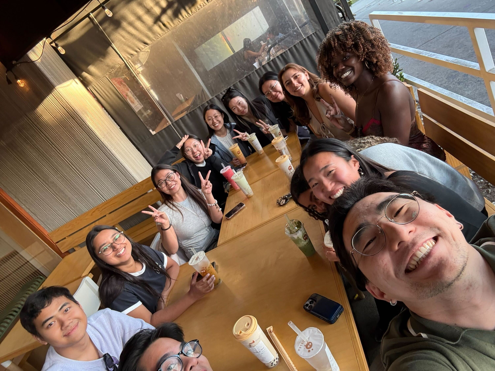
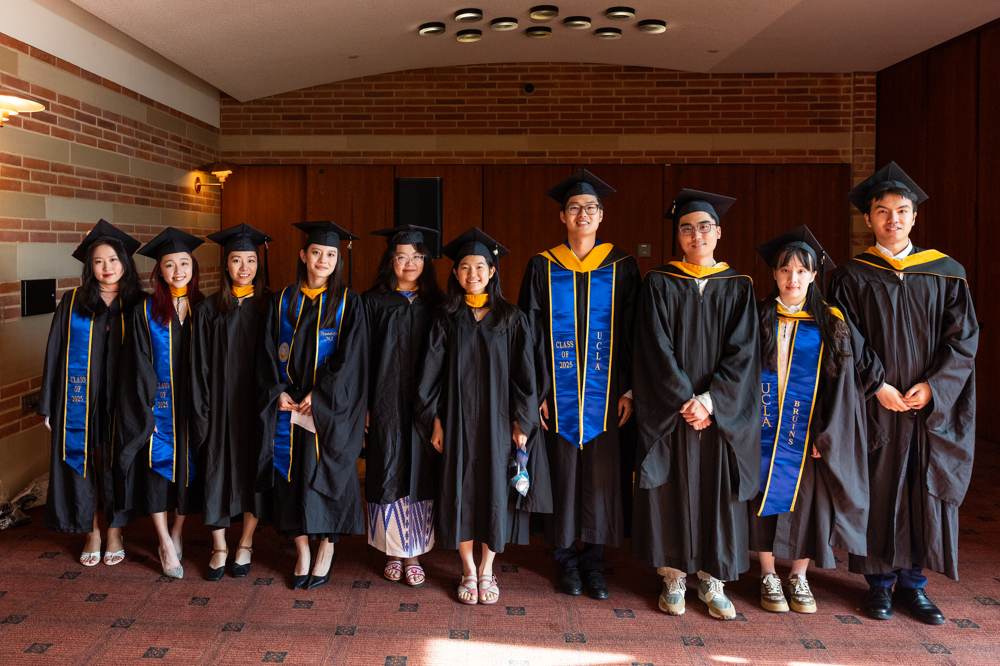

```{=html}
<style>
  .quarto-title-block, h1.title { display: none !important; }
</style>
```

```{=html}
<!-- ════════════════════════════════════════════════════════════════════
     ✏️  DIRECTORY FORM ANNOUNCEMENT — EDITABLE
     ════════════════════════════════════════════════════════════════════
     A one-time popup pointing students at the directory-info Google Form.
     It's triggered from the pinned-hero scroll driver below (search for
     "window.__bsaTriggerDirAnnounce") the moment the "Student Directory"
     title finishes crossfading in — not on page load. EDITABLE: the
     deadline date, the copy below, and the form URL in the button's href.
     Dismissing it (X, clicking outside, or Escape) hides it for the rest
     of the browser session (sessionStorage) — it reappears on the next
     fresh visit.
     ════════════════════════════════════════════════════════════════════ -->
<div class="dir-announce-overlay" id="dirAnnounceOverlay">
  <div class="dir-announce-box">
    <button class="dir-announce-close" id="dirAnnounceClose" aria-label="Close">
      <svg width="14" height="14" viewBox="0 0 24 24" fill="none" stroke="currentColor" stroke-width="2.5" stroke-linecap="round" stroke-linejoin="round"><line x1="18" y1="6" x2="6" y2="18"/><line x1="6" y1="6" x2="18" y2="18"/></svg>
    </button>
    <h2 class="dir-announce-title">Fill out the Student Directory Form</h2>
    <p class="dir-announce-body">
      If you are a <strong>new student</strong>, please fill out the Student Directory Form by <strong>October 9th</strong> to be populated.
    </p>
    <p class="dir-announce-body">
      If you are a <strong>returning student</strong>, this is your only time to modify your student directory information.
    </p>
    <a href="https://docs.google.com/forms/d/e/1FAIpQLSchqL1p8_M1wwoE4lxY7j9sqMfx5T4BUeR9ukXXuOJ845he0Q/viewform?usp=header" target="_blank" rel="noopener noreferrer" class="btn btn-lg btn-pill dir-announce-btn">Fill Out the Form &rarr;</a>
  </div>
</div>

<script>
(function () {
  var overlay  = document.getElementById('dirAnnounceOverlay');
  var closeBtn = document.getElementById('dirAnnounceClose');
  if (!overlay || !closeBtn) return;

  var STORAGE_KEY = 'bsa_dir_form_announce_dismissed';
  var alreadyDismissed = false;
  try { alreadyDismissed = sessionStorage.getItem(STORAGE_KEY) === '1'; } catch (e) {}
  var shown = false;

  function closeAnnounce() {
    overlay.classList.remove('active');
    try { sessionStorage.setItem(STORAGE_KEY, '1'); } catch (e) {}
  }

  // Called by the pinned-hero scroll driver once the "Student Directory"
  // title has finished crossfading in. Only ever shows once per page visit.
  window.__bsaTriggerDirAnnounce = function () {
    if (shown || alreadyDismissed) return;
    shown = true;
    overlay.classList.add('active');
  };

  closeBtn.addEventListener('click', closeAnnounce);
  overlay.addEventListener('click', function (e) { if (e.target === overlay) closeAnnounce(); });
  document.addEventListener('keydown', function (e) { if (e.key === 'Escape') closeAnnounce(); });
})();
</script>
```

```{=html}
<!-- ════════════════════════════════════════════════════════════════════
     ✏️  PINNED ZOOM-MORPH HERO — EDITABLE
     ════════════════════════════════════════════════════════════════════
     `.dir-hero-image img` below is the photo used for the effect —
     EDITABLE: swap its `src` for any other photo (e.g. from
     ../images/directory/) to change which one is shown. See the "PINNED
     ZOOM-MORPH HERO" section in directory/styles.css for how the
     grow/darken/text-crossfade effect itself works, and the small
     script at the bottom of this page for what drives it.
     ════════════════════════════════════════════════════════════════════ -->
<div class="dir-hero-pin" id="dirHeroPin">
  <div class="dir-hero-sticky">

    <div class="dir-hero-image">
      
      <div class="dir-hero-image-overlay"></div>
    </div>

    <!-- Initial state: one centered word, fades out as you scroll
         (see .dir-hero-intro in directory/styles.css). EDITABLE: the
         word below. -->
    <div class="dir-hero-intro">
      <div class="dir-hero-intro-word">Students</div>
    </div>

    <!-- End state (crossfades in as you scroll through the pin):
         "Student Directory" on the left, the three programs listed to
         its right (styled like the About page's newsletter list) —
         each a real link straight to that program's directory page
         (these replace the old "Browse by Program" card-grid section
         that used to sit below). -->
    <div class="dir-hero-final">
      <div class="dir-hero-final-row">
        <div class="dir-hero-final-title">Student<br>Directory</div>
        <ul class="dir-hero-programs">
          <li><a href="phd-students.html">PhD Students <span class="dir-hero-program-arrow">Explore →</span></a></li>
          <li><a href="ms-students.html">MS Students <span class="dir-hero-program-arrow">Explore →</span></a></li>
          <li><a href="mdsh-students.html">MDSH Students <span class="dir-hero-program-arrow">Explore →</span></a></li>
        </ul>
      </div>
      <div class="dir-hero-footnote">↓ Scroll down for alumni &amp; student statistics</div>
    </div>

  </div>
</div>

<div class="directory-landing">

  <!-- ── Student Statistics — image left / text right. EDITABLE: swap the
        below for any other photo. -->
  <section class="dir-split">
    <div class="dir-split-image reveal-grow">
      
    </div>
    <div class="dir-split-text">
      <div class="dir-split-title reveal-fade">Student Statistics</div>
      <p class="dir-split-desc reveal-fade">
        Explore anonymized, self-reported statistics from our students. This includes
        stats on their academic backgrounds, research areas, and more.
      </p>
      <a href="../stats/stats.html" class="btn btn-lg btn-pill reveal-fade">View Student Statistics</a>
    </div>
  </section>

  <!-- ── Alumni — same layout, inverted (text left / image right).
       EDITABLE: swap the  below for any other photo. -->
  <section class="dir-split dir-split-reverse">
    <div class="dir-split-image reveal-grow">
      
    </div>
    <div class="dir-split-text">
      <div class="dir-split-title reveal-fade">Alumni</div>
      <p class="dir-split-desc reveal-fade">
        Explore our alumni profiles. This list started collecting from the class of 2026. 
      </p>
      <a href="alumni.html" class="btn btn-lg btn-pill reveal-fade">Explore the Alumni Directory</a>
    </div>
  </section>

</div>

<!-- ════════════════════════════════════════════════════════════════════
     Pinned-hero scroll driver — sets a --progress CSS variable (0 to 1)
     on #dirHeroPin as you scroll through it; directory/styles.css's
     "PINNED ZOOM-MORPH HERO" section reads that variable to do the
     actual grow/darken/text-crossfade. Dividing by 0.8 below means the
     morph finishes with 20% of the pinned scroll distance left over,
     so the fully-zoomed state holds for a moment instead of instantly
     handing off to the next section. Safe to leave alone.
     ════════════════════════════════════════════════════════════════════ -->
<script>
(function () {
  var pin = document.getElementById('dirHeroPin');
  if (!pin) return;
  var ticking = false;

  function update() {
    var rect = pin.getBoundingClientRect();
    var scrollable = pin.offsetHeight - window.innerHeight;
    var raw = scrollable > 0 ? (-rect.top) / scrollable : 0;
    var progress = Math.min(Math.max(raw / 0.8, 0), 1);
    pin.style.setProperty('--progress', progress.toFixed(3));
    // .dir-hero-final's opacity (directory/styles.css) reaches 1 once
    // progress crosses ~0.935 — fire the form-announcement popup right as
    // the "Student Directory" title finishes crossfading in.
    if (progress >= 0.93 && window.__bsaTriggerDirAnnounce) {
      window.__bsaTriggerDirAnnounce();
    }
    ticking = false;
  }

  function onScroll() {
    if (!ticking) {
      requestAnimationFrame(update);
      ticking = true;
    }
  }

  window.addEventListener('scroll', onScroll, { passive: true });
  window.addEventListener('resize', onScroll);
  update();
})();
</script>
```

<!-- ════════════════════════════════════════════════════════════════════
     Scroll-reveal trigger — same one used on the Home page. Adds
     `.is-visible` to each `.reveal-grow`/`.reveal-fade` element (the
     Student Statistics / Alumni photos and text below the hero) the
     first time it scrolls into view; directory/styles.css's
     ".dir-split" section + the site-wide `.reveal-grow`/`.reveal-fade`
     rules handle the actual grow/fade transition. Safe to leave alone.
     ════════════════════════════════════════════════════════════════════ -->
```{=html}
<script>
(function () {
  var targets = document.querySelectorAll('.reveal-grow, .reveal-fade');
  if (!('IntersectionObserver' in window)) {
    targets.forEach(function (el) { el.classList.add('is-visible'); });
    return;
  }
  var io = new IntersectionObserver(function (entries) {
    entries.forEach(function (entry) {
      if (entry.isIntersecting) {
        entry.target.classList.add('is-visible');
        io.unobserve(entry.target);
      }
    });
  }, { threshold: 0.2 });

  function startObserving() {
    targets.forEach(function (el) { io.observe(el); });
  }

  if (window.scrollY > 0) {
    startObserving();
  } else {
    window.addEventListener('scroll', startObserving, { once: true, passive: true });
  }
})();
</script>
```
