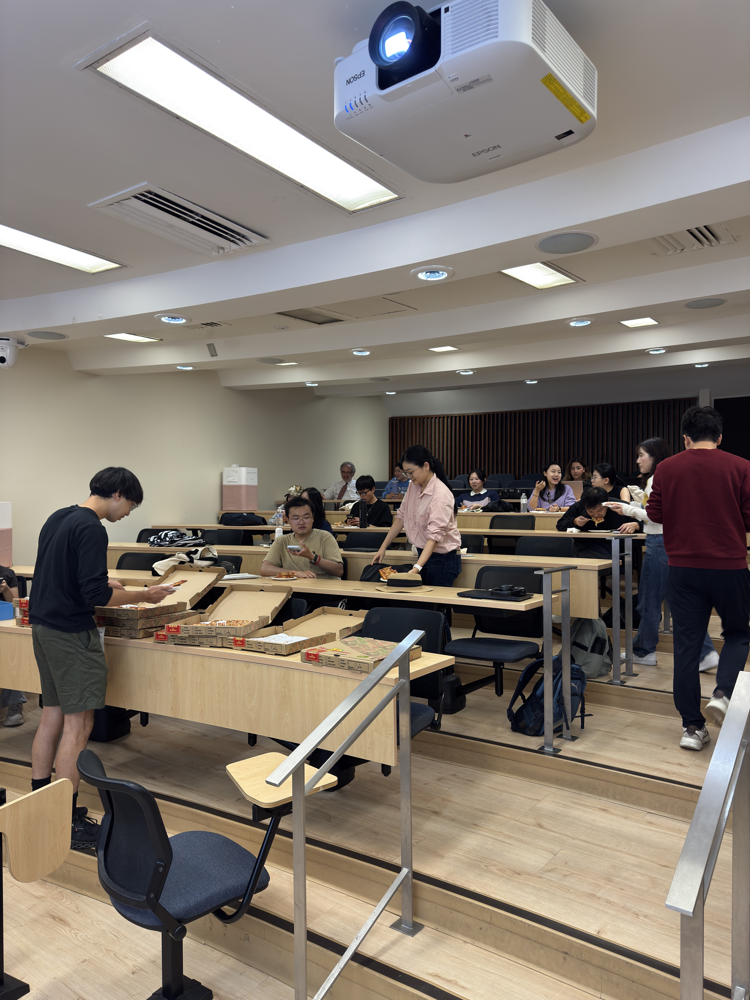

```{=html}
<div class="events-page">

  <!-- Header -->
  <div class="events-section-header">
    <h1>BSA Events</h1>
    <p>Stay connected with our community through talks, socials, and townhalls.</p>
  </div>

  <!-- Year filter (populated by JS) -->
  <div class="events-year-filter" id="yearFilter"></div>

  <!-- Carousel -->
  <div class="events-carousel-outer">
    <button class="carousel-arrow" id="prevArrow" aria-label="Previous" disabled>
      <svg width="18" height="18" viewBox="0 0 24 24" fill="none" stroke="currentColor" stroke-width="2.5" stroke-linecap="round" stroke-linejoin="round"><polyline points="15 18 9 12 15 6"/></svg>
    </button>
    <div class="events-track-container">
      <div class="events-track" id="eventsTrack"></div>
    </div>
    <button class="carousel-arrow" id="nextArrow" aria-label="Next">
      <svg width="18" height="18" viewBox="0 0 24 24" fill="none" stroke="currentColor" stroke-width="2.5" stroke-linecap="round" stroke-linejoin="round"><polyline points="9 18 15 12 9 6"/></svg>
    </button>
  </div>

  <!-- Dot indicators -->
  <div class="carousel-dots" id="carouselDots"></div>

</div>

<!-- Modal -->
<div class="event-modal-overlay" id="eventModal" role="dialog" aria-modal="true">
  <div class="event-modal-box" id="eventModalBox">
    <button class="modal-close-btn" id="modalCloseBtn" aria-label="Close">
      <svg width="14" height="14" viewBox="0 0 24 24" fill="none" stroke="currentColor" stroke-width="2.5" stroke-linecap="round" stroke-linejoin="round"><line x1="18" y1="6" x2="6" y2="18"/><line x1="6" y1="6" x2="18" y2="18"/></svg>
    </button>
    <div id="modalContent"></div>
  </div>
</div>

<script>
(function () {
  /* ── Config ─────────────────────────────── */
  var CARD_WIDTH = 280;   // px (must match CSS flex-basis)
  var CARD_GAP   = 24;    // px (1.5rem)
  var STEP       = CARD_WIDTH + CARD_GAP;

  /* ── State ──────────────────────────────── */
  var allEvents      = [];
  var filteredEvents = [];
  var currentIndex   = 0;
  var activeFilter   = 'upcoming';
  var visibleCount   = 1;

  /* ── Today's date string (YYYY-MM-DD) ────── */
  var today = new Date().toISOString().split('T')[0];

  /* ── Category → CSS class mapping ───────── */
  var catClass = {
    'lunch and learn': 'cat-lunch-learn',
    'townhall':        'cat-townhall',
    'social':          'cat-social',
    'workshop':        'cat-workshop'
  };

  function getCatClass(cat) {
    return catClass[(cat || '').toLowerCase()] || 'cat-default';
  }

  /* ── Placeholder SVG icon ────────────────── */
  var placeholderIcon =
    '<svg width="72" height="72" viewBox="0 0 24 24" fill="none" stroke="#fff" stroke-width="1.2" stroke-linecap="round" stroke-linejoin="round">' +
      '<rect x="3" y="3" width="18" height="18" rx="2"/>' +
      '<circle cx="8.5" cy="8.5" r="1.5"/>' +
      '<polyline points="21 15 16 10 5 21"/>' +
    '</svg>';

  /* ── CSV parser (handles quoted fields) ──── */
  function parseCSV(raw) {
    var lines = raw.trim().split(/\r?\n/);
    var headers = splitLine(lines[0]);
    var rows = [];
    for (var i = 1; i < lines.length; i++) {
      if (!lines[i].trim()) continue;
      var vals = splitLine(lines[i]);
      var obj = {};
      headers.forEach(function (h, idx) { obj[h.trim()] = (vals[idx] || '').trim(); });
      rows.push(obj);
    }
    return rows;
  }

  function splitLine(line) {
    var result = [], cur = '', inQ = false;
    for (var i = 0; i < line.length; i++) {
      var c = line[i];
      if (c === '"') { inQ = !inQ; }
      else if (c === ',' && !inQ) { result.push(cur); cur = ''; }
      else { cur += c; }
    }
    result.push(cur);
    return result;
  }

  /* ── Date helpers ────────────────────────── */
  var MONTHS = ['Jan','Feb','Mar','Apr','May','Jun','Jul','Aug','Sep','Oct','Nov','Dec'];

  // Normalise any date string to YYYY-MM-DD for sorting/comparison
  function normalizeDate(raw) {
    if (!raw || !raw.trim()) return '';
    raw = raw.trim();
    // Already YYYY-MM-DD
    if (/^\d{4}-\d{2}-\d{2}$/.test(raw)) return raw;
    // M/D/YY or M/D/YYYY
    var slash = raw.split('/');
    if (slash.length === 3) {
      var m = parseInt(slash[0], 10);
      var d = parseInt(slash[1], 10);
      var y = parseInt(slash[2], 10);
      if (y < 100) y += 2000;
      return y + '-' + (m < 10 ? '0' : '') + m + '-' + (d < 10 ? '0' : '') + d;
    }
    return raw;
  }

  function formatDate(raw) {
    var iso = normalizeDate(raw);
    if (!iso) return '';
    var parts = iso.split('-');
    if (parts.length < 3) return raw;
    return MONTHS[parseInt(parts[1], 10) - 1] + ' ' + parseInt(parts[2], 10) + ', ' + parts[0];
  }

  /* ── Photo helper ────────────────────────── */
  function photoHTML(photo, cls, placeholderSvgSize) {
    var size = placeholderSvgSize || 72;
    var svgIcon = '<svg width="' + size + '" height="' + size + '" viewBox="0 0 24 24" fill="none" stroke="#fff" stroke-width="1.2" stroke-linecap="round" stroke-linejoin="round">' +
      '<rect x="3" y="3" width="18" height="18" rx="2"/>' +
      '<circle cx="8.5" cy="8.5" r="1.5"/>' +
      '<polyline points="21 15 16 10 5 21"/>' +
      '</svg>';
    if (!photo || photo === 'placeholder') {
      return '<div class="' + cls + '-placeholder">' + svgIcon + '</div>';
    }
    return '<div class="' + cls + '-wrap"></div>';
  }

  /* ── Build a card element ─────────────────── */
  function buildCard(ev) {
    var card = document.createElement('div');
    card.className = 'event-card';
    card.setAttribute('tabindex', '0');
    card.setAttribute('role', 'button');
    card.setAttribute('aria-label', 'View details for ' + ev.title);

    var photoSection = (!ev.photo || ev.photo === 'placeholder')
      ? '<div class="card-photo-placeholder">' + placeholderIcon + '</div>'
      : '<div class="card-photo-wrap"></div>';

    var dateStr = ev.date ? formatDate(ev.date) : '';
    var dateNorm = normalizeDate(ev.date);
    var catCls  = getCatClass(ev.category);

    var metaHTML = '';
    if (ev.location) {
      metaHTML += '<div class="card-meta-item">' +
        '<svg width="12" height="12" viewBox="0 0 24 24" fill="none" stroke="currentColor" stroke-width="2" stroke-linecap="round" stroke-linejoin="round"><path d="M21 10c0 7-9 13-9 13s-9-6-9-13a9 9 0 0 1 18 0z"/><circle cx="12" cy="10" r="3"/></svg>' +
        ev.location + '</div>';
    }
    if (dateStr) {
      var dateTimeStr = dateStr + (ev.time ? ' · ' + ev.time : '');
      metaHTML += '<div class="card-meta-item">' +
        '<svg width="12" height="12" viewBox="0 0 24 24" fill="none" stroke="currentColor" stroke-width="2" stroke-linecap="round" stroke-linejoin="round"><rect x="3" y="4" width="18" height="18" rx="2" ry="2"/><line x1="16" y1="2" x2="16" y2="6"/><line x1="8" y1="2" x2="8" y2="6"/><line x1="3" y1="10" x2="21" y2="10"/></svg>' +
        dateTimeStr + '</div>';
    }

    card.innerHTML =
      photoSection +
      '<div class="card-body-inner">' +
        '<span class="card-category-badge ' + catCls + '">' + (ev.category || 'Event') + '</span>' +
        '<p class="card-title">' + ev.title + '</p>' +
        (metaHTML ? '<div class="card-meta">' + metaHTML + '</div>' : '') +
      '</div>';

    card.addEventListener('click', function () { openModal(ev); });
    card.addEventListener('keydown', function (e) { if (e.key === 'Enter' || e.key === ' ') { e.preventDefault(); openModal(ev); } });
    return card;
  }

  /* ── Modal ───────────────────────────────── */
  function openModal(ev) {
    var modal   = document.getElementById('eventModal');
    var content = document.getElementById('modalContent');
    var catCls  = getCatClass(ev.category);
    var dateStr = formatDate(ev.date);

    var photoSection = (!ev.photo || ev.photo === 'placeholder')
      ? '<div class="modal-photo-placeholder"><svg width="90" height="90" viewBox="0 0 24 24" fill="none" stroke="#fff" stroke-width="1" stroke-linecap="round" stroke-linejoin="round"><rect x="3" y="3" width="18" height="18" rx="2"/><circle cx="8.5" cy="8.5" r="1.5"/><polyline points="21 15 16 10 5 21"/></svg></div>'
      : '<div class="modal-photo-wrap"></div>';

    var metaItems = '';
    if (ev.location) {
      metaItems += '<div class="modal-meta-item">' +
        '<svg width="15" height="15" viewBox="0 0 24 24" fill="none" stroke="currentColor" stroke-width="2" stroke-linecap="round" stroke-linejoin="round"><path d="M21 10c0 7-9 13-9 13s-9-6-9-13a9 9 0 0 1 18 0z"/><circle cx="12" cy="10" r="3"/></svg>' +
        ev.location + '</div>';
    }
    if (dateStr) {
      var modalDateTimeStr = dateStr + (ev.time ? ' · ' + ev.time : '');
      metaItems += '<div class="modal-meta-item">' +
        '<svg width="15" height="15" viewBox="0 0 24 24" fill="none" stroke="currentColor" stroke-width="2" stroke-linecap="round" stroke-linejoin="round"><rect x="3" y="4" width="18" height="18" rx="2" ry="2"/><line x1="16" y1="2" x2="16" y2="6"/><line x1="8" y1="2" x2="8" y2="6"/><line x1="3" y1="10" x2="21" y2="10"/></svg>' +
        modalDateTimeStr + '</div>';
    }
    if (ev.academic_year) {
      metaItems += '<div class="modal-meta-item">' +
        '<svg width="15" height="15" viewBox="0 0 24 24" fill="none" stroke="currentColor" stroke-width="2" stroke-linecap="round" stroke-linejoin="round"><path d="M22 10v6M2 10l10-5 10 5-10 5z"/><path d="M6 12v5c3 3 9 3 12 0v-5"/></svg>' +
        'AY ' + ev.academic_year + '</div>';
    }

    var descClass = (!ev.description || ev.description === 'To Add') ? 'modal-description placeholder-desc' : 'modal-description';
    var descText  = (!ev.description || ev.description === 'To Add') ? 'Description coming soon.' : ev.description;

    var linkBtn = ev.link
      ? '<a href="' + ev.link + '" class="modal-link-btn" target="_blank" rel="noopener noreferrer">' +
          '<svg width="14" height="14" viewBox="0 0 24 24" fill="none" stroke="currentColor" stroke-width="2.5" stroke-linecap="round" stroke-linejoin="round"><path d="M18 13v6a2 2 0 0 1-2 2H5a2 2 0 0 1-2-2V8a2 2 0 0 1 2-2h6"/><polyline points="15 3 21 3 21 9"/><line x1="10" y1="14" x2="21" y2="3"/></svg>' +
          'Learn More</a>'
      : '';

    content.innerHTML =
      photoSection +
      '<div class="modal-body-inner">' +
        '<span class="modal-category-badge ' + catCls + '">' + (ev.category || 'Event') + '</span>' +
        '<h2 class="modal-title">' + ev.title + '</h2>' +
        (metaItems ? '<div class="modal-meta-row">' + metaItems + '</div>' : '') +
        '<p class="' + descClass + '">' + descText + '</p>' +
        linkBtn +
      '</div>';

    modal.classList.add('active');
    document.body.style.overflow = 'hidden';
  }

  function closeModal() {
    var modal = document.getElementById('eventModal');
    modal.classList.remove('active');
    document.body.style.overflow = '';
  }

  /* ── Carousel rendering ───────────────────── */
  function calcVisible() {
    var container = document.querySelector('.events-track-container');
    if (!container) return 1;
    return Math.max(1, Math.floor((container.offsetWidth + CARD_GAP) / STEP));
  }

  function renderTrack() {
    var track = document.getElementById('eventsTrack');
    track.innerHTML = '';
    filteredEvents.forEach(function (ev) {
      track.appendChild(buildCard(ev));
    });
    currentIndex = 0;
    renderDots();
    updateCarousel();
  }

  function renderDots() {
    var dots    = document.getElementById('carouselDots');
    var visible = calcVisible();
    var total   = Math.max(0, filteredEvents.length - visible + 1);
    dots.innerHTML = '';
    for (var i = 0; i < total; i++) {
      var btn = document.createElement('button');
      btn.className = 'carousel-dot' + (i === 0 ? ' active' : '');
      btn.setAttribute('aria-label', 'Go to slide ' + (i + 1));
      (function (idx) { btn.addEventListener('click', function () { goTo(idx); }); })(i);
      dots.appendChild(btn);
    }
  }

  function updateCarousel() {
    var track   = document.getElementById('eventsTrack');
    var prev    = document.getElementById('prevArrow');
    var next    = document.getElementById('nextArrow');
    var dots    = document.querySelectorAll('.carousel-dot');
    var visible = calcVisible();
    var maxIdx  = Math.max(0, filteredEvents.length - visible);

    currentIndex = Math.max(0, Math.min(currentIndex, maxIdx));
    track.style.transform = 'translateX(-' + (currentIndex * STEP) + 'px)';

    prev.disabled = (currentIndex === 0);
    next.disabled = (currentIndex >= maxIdx);

    dots.forEach(function (d, i) {
      d.classList.toggle('active', i === currentIndex);
    });
  }

  function goTo(idx) {
    currentIndex = idx;
    updateCarousel();
  }

  /* ── Filter ──────────────────────────────── */
  var FILTERS = [
    { key: 'upcoming', label: 'Upcoming Events' },
    { key: 'past',     label: 'Past Events' },
    { key: 'all',      label: 'All Events' }
  ];

  function renderFilter() {
    var container = document.getElementById('yearFilter');
    container.innerHTML = '';
    FILTERS.forEach(function (f) {
      var btn = document.createElement('button');
      btn.className = 'year-filter-btn' + (f.key === activeFilter ? ' active' : '');
      btn.textContent = f.label;
      btn.addEventListener('click', function () {
        activeFilter = f.key;
        document.querySelectorAll('.year-filter-btn').forEach(function (b) { b.classList.remove('active'); });
        btn.classList.add('active');
        applyFilter();
      });
      container.appendChild(btn);
    });
  }

  function applyFilter() {
    if (activeFilter === 'upcoming') {
      filteredEvents = allEvents.filter(function (ev) {
        var nd = normalizeDate(ev.date);
        return !nd || nd >= today;
      });
      filteredEvents.sort(function (a, b) {
        var na = normalizeDate(a.date), nb = normalizeDate(b.date);
        if (!na && !nb) return 0;
        if (!na) return 1;
        if (!nb) return -1;
        return na < nb ? -1 : 1;
      });
    } else if (activeFilter === 'past') {
      filteredEvents = allEvents.filter(function (ev) {
        var nd = normalizeDate(ev.date);
        return nd && nd < today;
      });
      filteredEvents.sort(function (a, b) {
        var na = normalizeDate(a.date), nb = normalizeDate(b.date);
        return na > nb ? -1 : 1;
      });
    } else {
      filteredEvents = allEvents.slice();
      filteredEvents.sort(function (a, b) {
        var na = normalizeDate(a.date), nb = normalizeDate(b.date);
        if (!na && !nb) return 0;
        if (!na) return 1;
        if (!nb) return -1;
        return na < nb ? -1 : 1;
      });
    }

    if (filteredEvents.length === 0) {
      var track = document.getElementById('eventsTrack');
      track.innerHTML = '';
      document.getElementById('carouselDots').innerHTML = '';
      document.getElementById('prevArrow').disabled = true;
      document.getElementById('nextArrow').disabled = true;
      var emptyMsg = activeFilter === 'upcoming'
        ? '📅 No upcoming events yet — check back soon!'
        : activeFilter === 'past'
        ? '🗂️ No past events to show.'
        : '📭 No events found.';
      track.innerHTML = '<p class="events-empty">' + emptyMsg + '</p>';
      return;
    }
    renderTrack();
  }

  /* ── Init ─────────────────────────────────── */
  function init() {
    /* Wire up modal close */
    document.getElementById('modalCloseBtn').addEventListener('click', closeModal);
    document.getElementById('eventModal').addEventListener('click', function (e) {
      if (e.target === this) closeModal();
    });
    document.addEventListener('keydown', function (e) {
      if (e.key === 'Escape') closeModal();
    });

    /* Wire up carousel arrows */
    document.getElementById('prevArrow').addEventListener('click', function () {
      if (currentIndex > 0) { currentIndex--; updateCarousel(); }
    });
    document.getElementById('nextArrow').addEventListener('click', function () {
      var visible = calcVisible();
      var maxIdx  = Math.max(0, filteredEvents.length - visible);
      if (currentIndex < maxIdx) { currentIndex++; updateCarousel(); }
    });

    /* Recalculate on resize */
    window.addEventListener('resize', function () {
      renderDots();
      updateCarousel();
    });

    /* Load CSV */
    fetch('./events.csv')
      .then(function (r) {
        if (!r.ok) throw new Error('Could not load events.csv');
        return r.text();
      })
      .then(function (text) {
        allEvents = parseCSV(text);
        renderFilter();
        applyFilter();
      })
      .catch(function (err) {
        document.getElementById('eventsTrack').innerHTML =
          '<p class="events-empty">🔧 Events are being updated — check back soon!</p>';
        console.warn('Events load error:', err);
      });
  }

  /* ── Important Dates ────────────────────── */
  (function () {
    var idToday = new Date().toISOString().split('T')[0];

    function idNorm(raw) { return normalizeDate(raw); }

    function idFormatDate(raw) { return formatDate(raw); }

    function idDaysUntil(raw) {
      var iso = idNorm(raw);
      return Math.ceil((new Date(iso + 'T00:00:00') - new Date()) / 86400000);
    }

    function idUrgency(raw) {
      var d = idDaysUntil(raw);
      if (d <= 3)  return 'urgency-red';
      if (d <= 7)  return 'urgency-orange';
      if (d <= 14) return 'urgency-yellow';
      return 'urgency-green';
    }

    function idParseCSV(raw) {
      // reuse shared parseCSV — already handles quoted fields
      return parseCSV(raw);
    }

    function idRender(items) {
      var grid    = document.getElementById('importantDatesList');
      var counter = document.getElementById('importantDatesCount');
      if (!grid) return;

      // Keep only rows with a title + date that haven't passed
      var upcoming = items.filter(function(d) {
        return d.title && d.date && idNorm(d.date) >= idToday;
      });
      upcoming.sort(function(a, b) { return idNorm(a.date) < idNorm(b.date) ? -1 : 1; });

      // Update stat counter
      if (counter) counter.textContent = upcoming.length || '—';

      if (upcoming.length === 0) {
        grid.innerHTML = '<p class="id-empty">No upcoming deadlines right now — check back soon.</p>';
        return;
      }

      // Urgency → banner gradient (matches .urgency-* colours)
      var urgencyGradient = {
        'urgency-red':    'linear-gradient(90deg,#ef5350,#c62828)',
        'urgency-orange': 'linear-gradient(90deg,#FF9800,#e65100)',
        'urgency-yellow': 'linear-gradient(90deg,#FFC107,#f9a825)',
        'urgency-green':  'linear-gradient(90deg,#66BB6A,#2e7d32)'
      };

      // Build one card per deadline
      grid.innerHTML = upcoming.map(function(d) {
        var uc  = idUrgency(d.date);
        var day = idDaysUntil(d.date);
        var tag = day === 0 ? 'Today!' : day === 1 ? 'Tomorrow' : 'in ' + day + ' days';
        var grad = urgencyGradient[uc] || urgencyGradient['urgency-green'];

        var titleHTML = d.link
          ? '<a href="' + d.link + '" target="_blank" rel="noopener" class="id-card-title-link">' + d.title + ' ↗</a>'
          : '<span class="id-card-title-text">' + d.title + '</span>';

        var ctaHTML = d.link
          ? '<a href="' + d.link + '" target="_blank" rel="noopener" class="id-card-cta">Open Form ↗</a>'
          : '';

        return '<div class="id-card">' +
          '<div class="id-card-banner" style="background:' + grad + ';"></div>' +
          '<div class="id-card-body">' +
            '<div class="id-urgency-badge ' + uc + '">' + tag + '</div>' +
            '<div class="id-card-title">' + titleHTML + '</div>' +
            '<div class="id-card-date">' + idFormatDate(d.date) + '</div>' +
            ctaHTML +
          '</div>' +
        '</div>';
      }).join('');
    }

    fetch('./important-dates.csv')
      .then(function(r) { return r.text(); })
      .then(function(text) { idRender(idParseCSV(text)); })
      .catch(function() {
        var list = document.getElementById('importantDatesList');
        if (list) list.innerHTML = '<li class="important-dates-empty">Could not load dates.</li>';
      });
  })();

  document.addEventListener('DOMContentLoaded', init);
})();
</script>
```

```{=html}
<!-- ══════════════════════════════════════════════════════════════════════════
     IMPORTANT DATES — data loaded from important-dates.csv
     CSV columns: title, link (optional), date (M/D/YY or YYYY-MM-DD)
     Cards are auto-coloured by urgency: red ≤3d · orange ≤7d · yellow ≤14d · green 14d+
     ══════════════════════════════════════════════════════════════════════════ -->
<div class="important-dates-section" id="important_dates">
  <div class="id-wrap">

    <!-- Header: title + live deadline count -->
    <div class="id-top">
      <div class="id-top-left">
        <div class="id-logo-tag">BSA · Key Deadlines</div>
        <div class="id-big-title">Important Dates</div>
        <p class="id-subtitle">Upcoming deadlines, forms, and academic dates for the UCLA Biostatistics community. Urgency colours update automatically based on today's date.</p>
      </div>
      <div class="id-stat">
        <div class="id-stat-num" id="importantDatesCount">—</div>
        <div class="id-stat-label">Upcoming</div>
      </div>
    </div>

    <!-- Cards injected here by JS idRender() -->
    <div class="id-cards-grid" id="importantDatesList">
      <p class="id-loading">Loading&hellip;</p>
    </div>

  </div>
</div>
```

```{=html}
<div class="recurring-section">
  <h2 class="recurring-title">Recurring Events</h2>
  <div class="recurring-row">
    <div class="recurring-text">
      <div class="recurring-badge cat-lunch-learn">Lunch and Learn</div>
      <h3>Lunch &amp; Learn</h3>
      <p>Our Our Lunch &amp; Lunch series is a monthly event during the Fall and Winter Quarters that brings biostatistics students and faculty together for informal seminar events over lunch. In the past, we have hosted Internship Panels, Student Research Talks, LinkedIn 101, and Faculty Flash Talks. <br><br> If you are interested in helping or have any ideas to be featured in Lunch &amp; Learn, contact Cindy Pang and Darren Lin for information. </p>
    </div>
    <div class="recurring-image-wrap">
      <div class="recurring-image-placeholder">
        
      </div>
    </div>
  </div>
  <div class="recurring-row recurring-row-reverse">
    <div class="recurring-image-wrap">
      <div class="recurring-image-placeholder">
        <svg width="64" height="64" viewBox="0 0 24 24" fill="none" stroke="#fff" stroke-width="1.2" stroke-linecap="round" stroke-linejoin="round"><rect x="3" y="3" width="18" height="18" rx="2"></rect><circle cx="8.5" cy="8.5" r="1.5"></circle><polyline points="21 15 16 10 5 21"></polyline></svg>
      </div>
    </div>
    <div class="recurring-text">
      <div class="recurring-badge cat-townhall">Townhall</div>
      <h3>Townhall</h3>
      <p>Townhall is a quarterly student event that gives biostatistics students an opportunity to get updates on BSA projects over some free food. Further, this event gives students a space to voice concerns and feedbacks for BSA to be advocating for within our department.</p>
    </div>
  </div>
</div>
```
