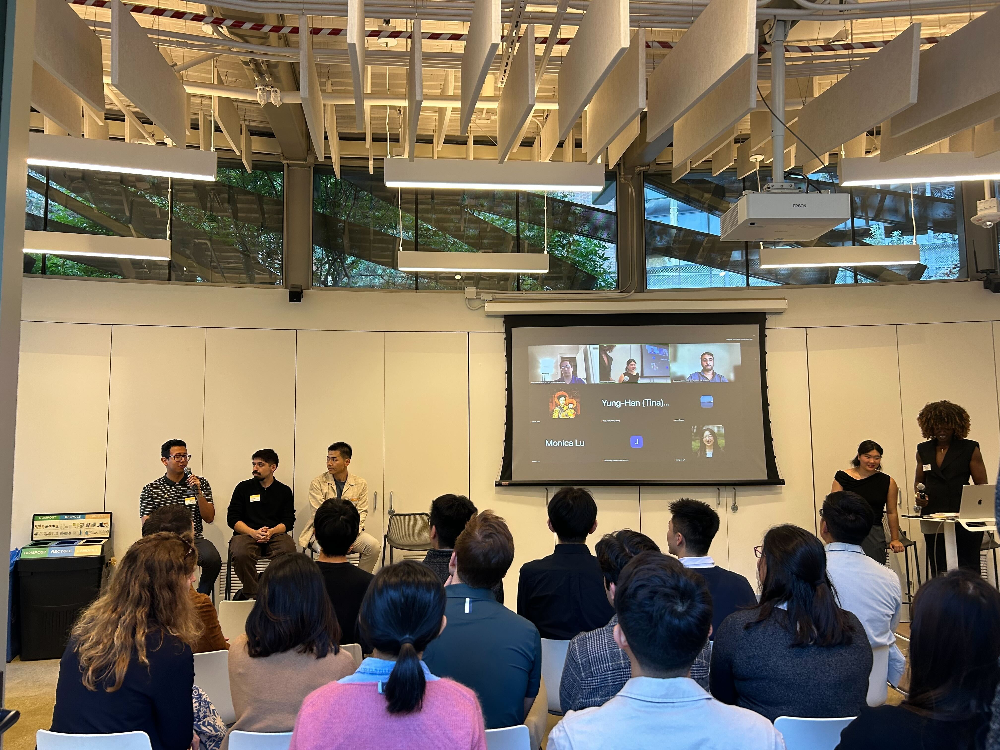
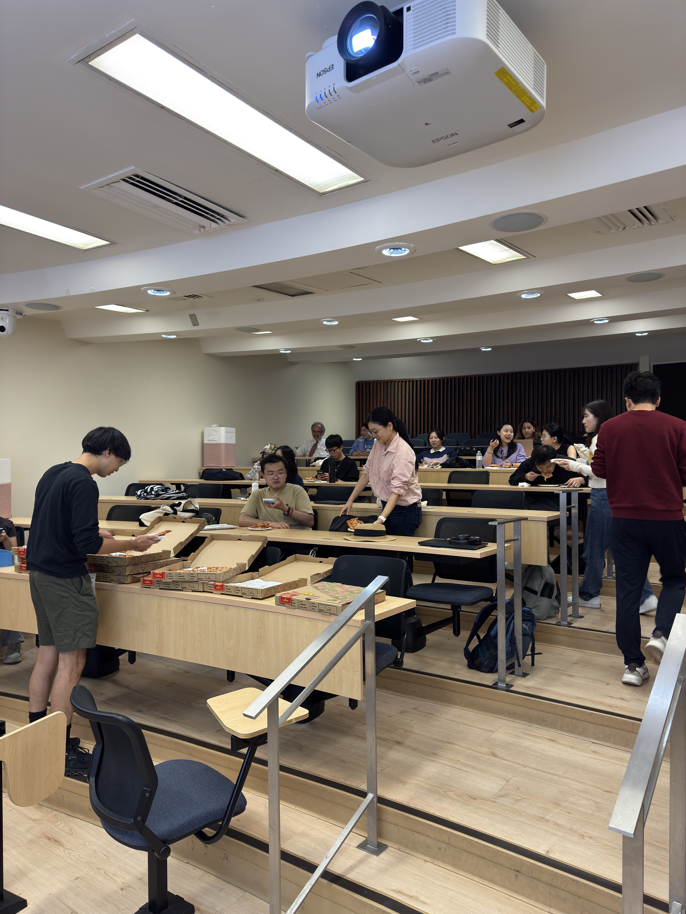
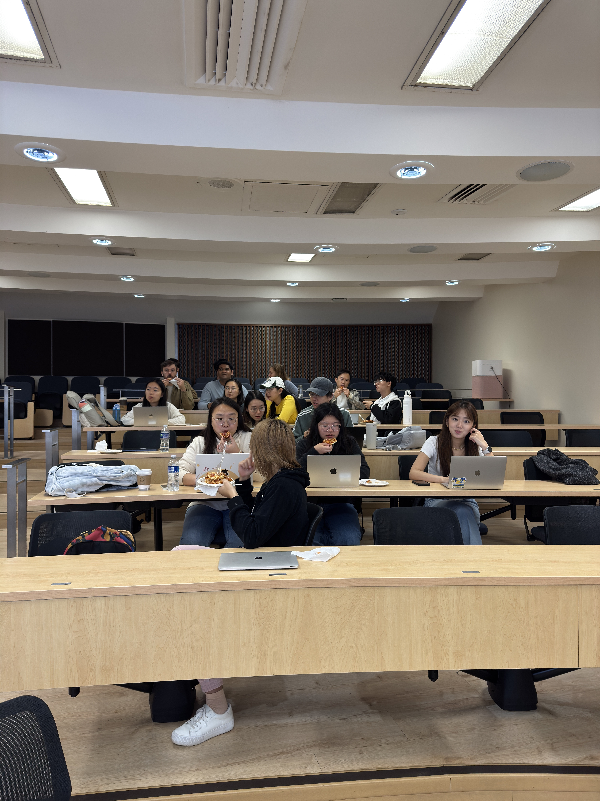
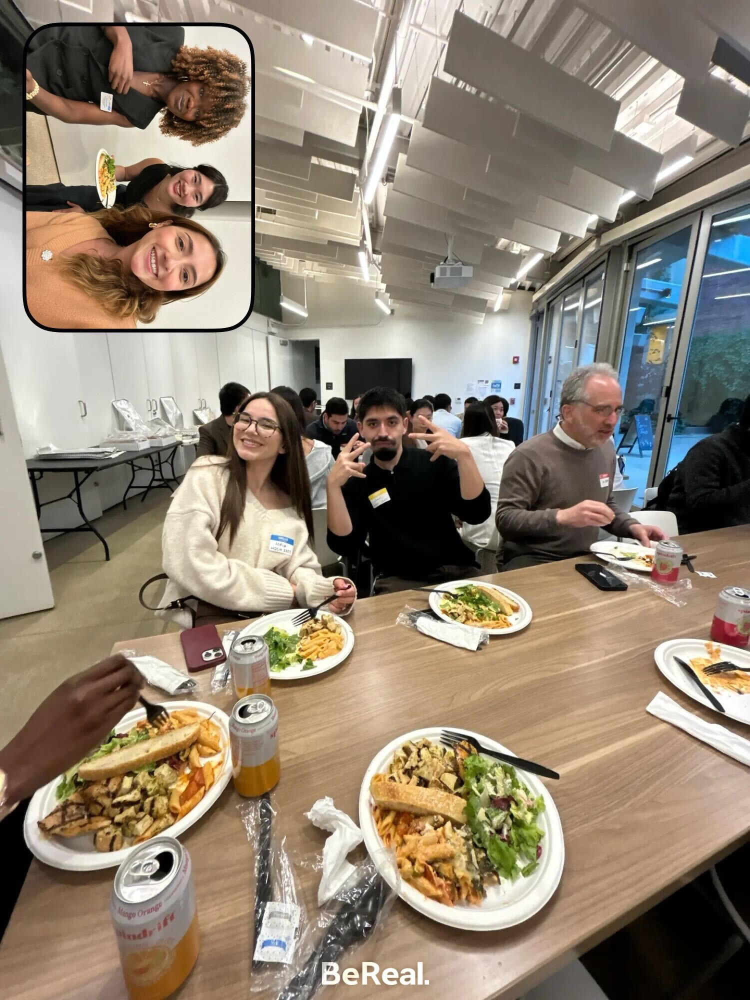

```{=html}
<style>
.quarto-title-block { display: none !important; }
</style>

<!-- ── Events banner — full-bleed, darkened. EDITABLE: swap the 
     below for any other photo in ../images/events/. -->
<div class="page-hero events-banner">
  
  <div class="events-banner-title">Events</div>
</div>

<div class="events-page">

  <!-- Header -->
  <div class="events-section-header">
    <p>RSVP to Upcoming Events and follow us on Instagram for up to date detail.</p>
  </div>

  <!-- Year filter (populated by JS) -->
  <div class="events-year-filter" id="yearFilter"></div>

  <!-- Grid — Upcoming Events (flat, paginated) -->
  <div class="events-grid" id="eventsGrid"></div>

  <!-- Load more — Upcoming Events only -->
  <div class="events-load-more-wrap" id="loadMoreWrap">
    <button class="btn btn-lg btn-pill-outline" id="loadMoreBtn" style="display:none;">Load More</button>
  </div>

  <!-- Accordion — Past Events, one collapsible section per academic year -->
  <div id="eventsAccordion" style="display:none;"></div>

</div>

<!-- Modal -->
<div class="event-modal-overlay" id="eventModal" role="dialog" aria-modal="true">
  <div class="event-modal-box" id="eventModalBox">
    <button class="modal-close-btn" id="modalCloseBtn" aria-label="Close">
      <svg width="14" height="14" viewBox="0 0 24 24" fill="none" stroke="currentColor" stroke-width="2.5" stroke-linecap="round" stroke-linejoin="round"><line x1="18" y1="6" x2="6" y2="18"/><line x1="6" y1="6" x2="18" y2="18"/></svg>
    </button>
    <div id="modalContent"></div>
  </div>
</div>

<script>
(function () {
  /* ── Config ─────────────────────────────── */
  var PAGE_SIZE = 6;   // cards revealed initially, and per "Load More" click

  /* ── State ──────────────────────────────── */
  var allEvents      = [];
  var filteredEvents = [];
  var activeFilter   = 'upcoming';
  var visibleCount   = PAGE_SIZE;

  /* ── Today's date string (YYYY-MM-DD) ────── */
  var today = new Date().toISOString().split('T')[0];

  /* ── Category → CSS class mapping ───────── */
  var catClass = {
    'lunch and learn': 'cat-lunch-learn',
    'townhall':        'cat-townhall',
    'social':          'cat-social',
    'workshop':        'cat-workshop'
  };

  function getCatClass(cat) {
    return catClass[(cat || '').toLowerCase()] || 'cat-default';
  }

  /* ── Category → solid color (for the photo date-badge) ──── */
  var catSolid = {
    'lunch and learn': '#2e7d32',
    'townhall':        '#1565c0',
    'social':          '#e65100',
    'workshop':        '#6a1b9a'
  };

  function getCatSolid(cat) {
    return catSolid[(cat || '').toLowerCase()] || '#003B5C';
  }

  /* ── Strip HTML + truncate, for the card's description snippet ──── */
  function truncate(html, max) {
    var plain = (html || '').replace(/<[^>]*>/g, '').trim();
    if (plain.length <= max) return plain;
    return plain.slice(0, max).trim() + '…';
  }

  /* ── Placeholder SVG icon ────────────────── */
  var placeholderIcon =
    '<svg width="72" height="72" viewBox="0 0 24 24" fill="none" stroke="#fff" stroke-width="1.2" stroke-linecap="round" stroke-linejoin="round">' +
      '<rect x="3" y="3" width="18" height="18" rx="2"/>' +
      '<circle cx="8.5" cy="8.5" r="1.5"/>' +
      '<polyline points="21 15 16 10 5 21"/>' +
    '</svg>';

  /* ── CSV parser (handles quoted fields) ──── */
  function parseCSV(raw) {
    var lines = raw.trim().split(/\r?\n/);
    var headers = splitLine(lines[0]);
    var rows = [];
    for (var i = 1; i < lines.length; i++) {
      if (!lines[i].trim()) continue;
      var vals = splitLine(lines[i]);
      var obj = {};
      headers.forEach(function (h, idx) { obj[h.trim()] = (vals[idx] || '').trim(); });
      rows.push(obj);
    }
    return rows;
  }

  function splitLine(line) {
    var result = [], cur = '', inQ = false;
    for (var i = 0; i < line.length; i++) {
      var c = line[i];
      if (c === '"') { inQ = !inQ; }
      else if (c === ',' && !inQ) { result.push(cur); cur = ''; }
      else { cur += c; }
    }
    result.push(cur);
    return result;
  }

  /* ── Date helpers ────────────────────────── */
  var MONTHS = ['Jan','Feb','Mar','Apr','May','Jun','Jul','Aug','Sep','Oct','Nov','Dec'];

  // Normalise any date string to YYYY-MM-DD for sorting/comparison
  function normalizeDate(raw) {
    if (!raw || !raw.trim()) return '';
    raw = raw.trim();
    // Already YYYY-MM-DD
    if (/^\d{4}-\d{2}-\d{2}$/.test(raw)) return raw;
    // M/D/YY or M/D/YYYY
    var slash = raw.split('/');
    if (slash.length === 3) {
      var m = parseInt(slash[0], 10);
      var d = parseInt(slash[1], 10);
      var y = parseInt(slash[2], 10);
      if (y < 100) y += 2000;
      return y + '-' + (m < 10 ? '0' : '') + m + '-' + (d < 10 ? '0' : '') + d;
    }
    return raw;
  }

  function formatDate(raw) {
    var iso = normalizeDate(raw);
    if (!iso) return '';
    var parts = iso.split('-');
    if (parts.length < 3) return raw;
    return MONTHS[parseInt(parts[1], 10) - 1] + ' ' + parseInt(parts[2], 10) + ', ' + parts[0];
  }

  // Day-number + "Mon YYYY" pair for the card's photo date-badge
  function dateBadgeParts(raw) {
    var iso = normalizeDate(raw);
    if (!iso) return null;
    var parts = iso.split('-');
    if (parts.length < 3) return null;
    var y = parts[0], m = parseInt(parts[1], 10), d = parseInt(parts[2], 10);
    return { day: (d < 10 ? '0' : '') + d, month: MONTHS[m - 1] + ' ' + y };
  }

  /* ── Photo helper ────────────────────────── */
  function photoHTML(photo, cls, placeholderSvgSize) {
    var size = placeholderSvgSize || 72;
    var svgIcon = '<svg width="' + size + '" height="' + size + '" viewBox="0 0 24 24" fill="none" stroke="#fff" stroke-width="1.2" stroke-linecap="round" stroke-linejoin="round">' +
      '<rect x="3" y="3" width="18" height="18" rx="2"/>' +
      '<circle cx="8.5" cy="8.5" r="1.5"/>' +
      '<polyline points="21 15 16 10 5 21"/>' +
      '</svg>';
    if (!photo || photo === 'placeholder') {
      return '<div class="' + cls + '-placeholder">' + svgIcon + '</div>';
    }
    return '<div class="' + cls + '-wrap"></div>';
  }

  /* ── Build a card element ─────────────────── */
  function buildCard(ev) {
    var card = document.createElement('div');
    card.className = 'event-card';
    card.setAttribute('tabindex', '0');
    card.setAttribute('role', 'button');
    card.setAttribute('aria-label', 'View details for ' + ev.title);

    var catSolid  = getCatSolid(ev.category);
    var dateParts = dateBadgeParts(ev.date);

    // Left rail: date on top, location pinned to the bottom — same
    // colored block for both, one per category (see getCatSolid).
    var dateRailHTML = '<div class="card-date-rail" style="background:' + catSolid + ';">' +
      (dateParts
        ? '<div class="card-date-day">' + dateParts.day + '</div>' +
          '<div class="card-date-month">' + dateParts.month + '</div>'
        : '') +
      (ev.location ? '<div class="card-date-location">' + ev.location + '</div>' : '') +
    '</div>';

    var photoSection = (!ev.photo || ev.photo === 'placeholder')
      ? '<div class="card-photo-placeholder">' + placeholderIcon + '</div>'
      : '<div class="card-photo-wrap"></div>';

    var descText = ev.description ? truncate(ev.description, 90) : '';
    var timeHTML = ev.time ? '<p class="card-time">' + ev.time + '</p>' : '';

    // "Register Now" always renders (RSVP link comes from the CSV's `link`
    // column); with no link yet, it shows disabled rather than going nowhere.
    var hasLink = !!ev.link;
    var registerHTML = '<a href="' + (hasLink ? ev.link : '#') +
      '" class="card-register-btn' + (hasLink ? '' : ' card-register-btn-disabled') + '"' +
      (hasLink ? ' target="_blank" rel="noopener noreferrer"' : ' aria-disabled="true" tabindex="-1"') +
      '>Register Now</a>';

    card.innerHTML =
      dateRailHTML +
      '<div class="card-main">' +
        photoSection +
        '<div class="card-body-inner">' +
          '<span class="card-category-eyebrow" style="color:' + catSolid + ';">' + (ev.category || 'Event') + '</span>' +
          '<p class="card-title">' + ev.title + '</p>' +
          timeHTML +
          (descText ? '<p class="card-desc">' + descText + '</p>' : '') +
          '<div class="card-cta-row">' +
            registerHTML +
            '<span class="card-readmore">Read More &rarr;</span>' +
          '</div>' +
        '</div>' +
      '</div>';

    var registerBtn = card.querySelector('.card-register-btn');
    if (registerBtn && hasLink) {
      registerBtn.addEventListener('click', function (e) { e.stopPropagation(); });
    }

    card.addEventListener('click', function () { openModal(ev); });
    card.addEventListener('keydown', function (e) { if (e.key === 'Enter' || e.key === ' ') { e.preventDefault(); openModal(ev); } });
    return card;
  }

  /* ── Modal ───────────────────────────────── */
  function openModal(ev) {
    var modal   = document.getElementById('eventModal');
    var content = document.getElementById('modalContent');
    var catCls  = getCatClass(ev.category);
    var dateStr = formatDate(ev.date);

    var photoSection = (!ev.photo || ev.photo === 'placeholder')
      ? '<div class="modal-photo-placeholder"><svg width="90" height="90" viewBox="0 0 24 24" fill="none" stroke="#fff" stroke-width="1" stroke-linecap="round" stroke-linejoin="round"><rect x="3" y="3" width="18" height="18" rx="2"/><circle cx="8.5" cy="8.5" r="1.5"/><polyline points="21 15 16 10 5 21"/></svg></div>'
      : '<div class="modal-photo-wrap"></div>';

    var metaItems = '';
    if (ev.location) {
      metaItems += '<div class="modal-meta-item">' +
        '<svg width="15" height="15" viewBox="0 0 24 24" fill="none" stroke="currentColor" stroke-width="2" stroke-linecap="round" stroke-linejoin="round"><path d="M21 10c0 7-9 13-9 13s-9-6-9-13a9 9 0 0 1 18 0z"/><circle cx="12" cy="10" r="3"/></svg>' +
        ev.location + '</div>';
    }
    if (dateStr) {
      var modalDateTimeStr = dateStr + (ev.time ? ' · ' + ev.time : '');
      metaItems += '<div class="modal-meta-item">' +
        '<svg width="15" height="15" viewBox="0 0 24 24" fill="none" stroke="currentColor" stroke-width="2" stroke-linecap="round" stroke-linejoin="round"><rect x="3" y="4" width="18" height="18" rx="2" ry="2"/><line x1="16" y1="2" x2="16" y2="6"/><line x1="8" y1="2" x2="8" y2="6"/><line x1="3" y1="10" x2="21" y2="10"/></svg>' +
        modalDateTimeStr + '</div>';
    }
    if (ev.academic_year) {
      metaItems += '<div class="modal-meta-item">' +
        '<svg width="15" height="15" viewBox="0 0 24 24" fill="none" stroke="currentColor" stroke-width="2" stroke-linecap="round" stroke-linejoin="round"><path d="M22 10v6M2 10l10-5 10 5-10 5z"/><path d="M6 12v5c3 3 9 3 12 0v-5"/></svg>' +
        'AY ' + ev.academic_year + '</div>';
    }

    var descClass = (!ev.description || ev.description === 'To Add') ? 'modal-description placeholder-desc' : 'modal-description';
    var descText  = (!ev.description || ev.description === 'To Add') ? 'Description coming soon.' : ev.description;

    var linkBtn = ev.link
      ? '<a href="' + ev.link + '" class="modal-link-btn" target="_blank" rel="noopener noreferrer">' +
          '<svg width="14" height="14" viewBox="0 0 24 24" fill="none" stroke="currentColor" stroke-width="2.5" stroke-linecap="round" stroke-linejoin="round"><path d="M18 13v6a2 2 0 0 1-2 2H5a2 2 0 0 1-2-2V8a2 2 0 0 1 2-2h6"/><polyline points="15 3 21 3 21 9"/><line x1="10" y1="14" x2="21" y2="3"/></svg>' +
          'Learn More</a>'
      : '';

    content.innerHTML =
      photoSection +
      '<div class="modal-body-inner">' +
        '<span class="modal-category-badge ' + catCls + '">' + (ev.category || 'Event') + '</span>' +
        '<h2 class="modal-title">' + ev.title + '</h2>' +
        (metaItems ? '<div class="modal-meta-row">' + metaItems + '</div>' : '') +
        '<p class="' + descClass + '">' + descText + '</p>' +
        linkBtn +
      '</div>';

    modal.classList.add('active');
    document.body.style.overflow = 'hidden';
  }

  function closeModal() {
    var modal = document.getElementById('eventModal');
    modal.classList.remove('active');
    document.body.style.overflow = '';
  }

  /* ── Grid rendering, with a staggered fade-in (reuses the site-wide
     .reveal-fade look — see styles.css — just triggered immediately on
     render instead of via scroll, since the grid sits high on the page). */
  function revealCards(cards) {
    cards.forEach(function (card, i) {
      card.style.transitionDelay = (Math.min(i, 8) * 0.07) + 's';
    });
    requestAnimationFrame(function () {
      requestAnimationFrame(function () {
        cards.forEach(function (card) { card.classList.add('is-visible'); });
      });
    });
  }

  // Group events by academic_year, most-recent-year first (and by date
  // descending within each year) — used for the Past Events accordion.
  function groupByYear(events) {
    var order = [], byYear = {};
    events.forEach(function (ev) {
      var y = ev.academic_year || 'Unknown';
      if (!byYear[y]) { byYear[y] = []; order.push(y); }
      byYear[y].push(ev);
    });
    order.sort(function (a, b) { return academicYearKey(b) - academicYearKey(a); });
    return order.map(function (y) { return { year: y, events: byYear[y] }; });
  }

  function render() {
    var grid       = document.getElementById('eventsGrid');
    var loadMore    = document.getElementById('loadMoreWrap');
    var accordion   = document.getElementById('eventsAccordion');

    if (activeFilter === 'past') {
      grid.style.display = 'none';
      grid.innerHTML = '';
      loadMore.style.display = 'none';
      accordion.style.display = '';
      renderAccordion(accordion);
    } else {
      accordion.style.display = 'none';
      accordion.innerHTML = '';
      grid.style.display = '';
      renderFlatGrid(grid, loadMore);
    }
  }

  // Upcoming Events — flat grid, paginated 6-at-a-time via "Load More".
  function renderFlatGrid(grid, loadMoreWrap) {
    grid.innerHTML = '';

    if (filteredEvents.length === 0) {
      grid.innerHTML = '<p class="events-empty"> No upcoming events yet. Follow us on isntagram for more up to date info. </p>';
      loadMoreWrap.style.display = 'none';
      return;
    }

    loadMoreWrap.style.display = '';
    var slice    = filteredEvents.slice(0, visibleCount);
    var newCards = [];

    slice.forEach(function (ev) {
      var card = buildCard(ev);
      card.classList.add('reveal-fade');
      grid.appendChild(card);
      newCards.push(card);
    });

    revealCards(newCards);

    var loadMoreBtn = document.getElementById('loadMoreBtn');
    loadMoreBtn.style.display = (visibleCount < filteredEvents.length) ? '' : 'none';
  }

  // Past Events — one collapsible section per academic year (most recent
  // year open by default; the rest collapsed until clicked).
  function renderAccordion(container) {
    container.innerHTML = '';

    if (filteredEvents.length === 0) {
      container.innerHTML = '<p class="events-empty">🗂️ No past events to show.</p>';
      return;
    }

    var groups = groupByYear(filteredEvents);

    groups.forEach(function (group, gi) {
      var isOpen = (gi === 0);

      var section = document.createElement('div');
      section.className = 'events-year-group';

      var header = document.createElement('button');
      header.className = 'events-year-toggle' + (isOpen ? ' open' : '');
      header.setAttribute('aria-expanded', isOpen ? 'true' : 'false');
      header.innerHTML =
        '<span>AY ' + group.year + '</span>' +
        '<span class="events-year-toggle-count">' + group.events.length + ' event' + (group.events.length === 1 ? '' : 's') + '</span>' +
        '<svg class="events-year-toggle-chevron" width="16" height="16" viewBox="0 0 24 24" fill="none" stroke="currentColor" stroke-width="2.5" stroke-linecap="round" stroke-linejoin="round"><polyline points="6 9 12 15 18 9"/></svg>';

      var panel = document.createElement('div');
      panel.className = 'events-year-panel' + (isOpen ? ' open' : '');

      var innerGrid = document.createElement('div');
      innerGrid.className = 'events-grid';
      var cards = [];
      group.events.forEach(function (ev) {
        var card = buildCard(ev);
        card.classList.add('reveal-fade');
        innerGrid.appendChild(card);
        cards.push(card);
      });
      panel.appendChild(innerGrid);

      header.addEventListener('click', function () {
        var nowOpen = !panel.classList.contains('open');
        panel.classList.toggle('open', nowOpen);
        header.classList.toggle('open', nowOpen);
        header.setAttribute('aria-expanded', nowOpen ? 'true' : 'false');
        if (nowOpen) revealCards(cards);
      });

      section.appendChild(header);
      section.appendChild(panel);
      container.appendChild(section);

      if (isOpen) revealCards(cards);
    });
  }

  /* ── Filter ──────────────────────────────── */
  var FILTERS = [
    { key: 'upcoming', label: 'Upcoming Events' },
    { key: 'past',     label: 'Past Events' }
  ];

  function renderFilter() {
    var container = document.getElementById('yearFilter');
    container.innerHTML = '';
    FILTERS.forEach(function (f) {
      var btn = document.createElement('button');
      btn.className = 'year-filter-btn' + (f.key === activeFilter ? ' active' : '');
      btn.textContent = f.label;
      btn.addEventListener('click', function () {
        activeFilter = f.key;
        visibleCount = PAGE_SIZE;
        document.querySelectorAll('.year-filter-btn').forEach(function (b) { b.classList.remove('active'); });
        btn.classList.add('active');
        applyFilter();
      });
      container.appendChild(btn);
    });
  }

  // Sort key for an event's academic_year ("25-26" → 25), for grouping
  // past events most-recent-year-first.
  function academicYearKey(ay) {
    var m = /^(\d{2})/.exec(ay || '');
    return m ? parseInt(m[1], 10) : -1;
  }

  function applyFilter() {
    if (activeFilter === 'upcoming') {
      filteredEvents = allEvents.filter(function (ev) {
        var nd = normalizeDate(ev.date);
        return !nd || nd >= today;
      });
      filteredEvents.sort(function (a, b) {
        var na = normalizeDate(a.date), nb = normalizeDate(b.date);
        if (!na && !nb) return 0;
        if (!na) return 1;
        if (!nb) return -1;
        return na < nb ? -1 : 1;
      });
    } else {
      filteredEvents = allEvents.filter(function (ev) {
        var nd = normalizeDate(ev.date);
        return nd && nd < today;
      });
      filteredEvents.sort(function (a, b) {
        var ya = academicYearKey(a.academic_year), yb = academicYearKey(b.academic_year);
        if (ya !== yb) return yb - ya;
        var na = normalizeDate(a.date), nb = normalizeDate(b.date);
        return na > nb ? -1 : 1;
      });
    }

    render();
  }

  /* ── Init ─────────────────────────────────── */
  function init() {
    /* Wire up modal close */
    document.getElementById('modalCloseBtn').addEventListener('click', closeModal);
    document.getElementById('eventModal').addEventListener('click', function (e) {
      if (e.target === this) closeModal();
    });
    document.addEventListener('keydown', function (e) {
      if (e.key === 'Escape') closeModal();
    });

    /* Wire up "Load More" */
    document.getElementById('loadMoreBtn').addEventListener('click', function () {
      visibleCount += PAGE_SIZE;
      renderFlatGrid(document.getElementById('eventsGrid'), document.getElementById('loadMoreWrap'));
    });

    /* Load CSV */
    fetch('./events.csv')
      .then(function (r) {
        if (!r.ok) throw new Error('Could not load events.csv');
        return r.text();
      })
      .then(function (text) {
        allEvents = parseCSV(text);
        renderFilter();
        applyFilter();
      })
      .catch(function (err) {
        document.getElementById('eventsGrid').innerHTML =
          '<p class="events-empty">🔧 Events are being updated — check back soon!</p>';
        console.warn('Events load error:', err);
      });
  }

  document.addEventListener('DOMContentLoaded', init);
})();
</script>
```

```{=html}
<div class="recurring-section">
  <h2 class="recurring-title">Recurring Events</h2>
  <div class="recurring-rows">

    <div class="recurring-row">
      <div class="recurring-image">
        
      </div>
      <div class="recurring-box">
        <span class="recurring-box-eyebrow" style="color:#8fd19e;">Lunch and Learn</span>
        <div class="recurring-box-title">Lunch &amp; Learn</div>
        <p class="recurring-box-desc">Events hosted during the Fall and Winter Quarters that brings biostatistics students and faculty together for informal seminar events over lunch. In the past, we have hosted Internship Panels, Student Research Talks, LinkedIn 101, and Faculty Flash Talks. Interested in helping or have an idea to feature? Contact Cindy Pang and Darren Lin.</p>
      </div>
    </div>

    <div class="recurring-row recurring-row-reverse">
      <div class="recurring-image">
        
      </div>
      <div class="recurring-box recurring-box-gold">
        <span class="recurring-box-eyebrow">Townhall</span>
        <div class="recurring-box-title">Townhall</div>
        <p class="recurring-box-desc">A quarterly student event that gives biostatistics students an opportunity to get updates on BSA projects over snacks, and a space to voice concerns and feedback for BSA to advocate for within our department.</p>
      </div>
    </div>

    <div class="recurring-row">
      <div class="recurring-image">
        
      </div>
      <div class="recurring-box">
        <span class="recurring-box-eyebrow" style="color:#FFD100;">Social</span>
        <div class="recurring-box-title">Alumni Mixer</div>
        <p class="recurring-box-desc">Our annual Alumni Mixer &amp; Panel gathers students, faculty, and alumni for a night of networking and food! Alumni are given opportunities to share their career advice and connect with current students.</p>
      </div>
    </div>

  </div>
</div>
```
