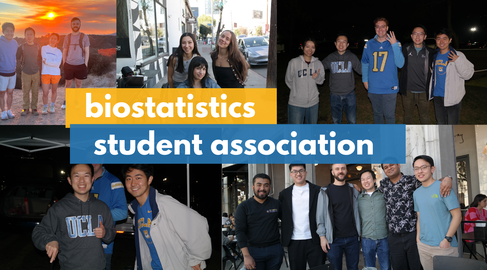

:::: hero-banner

::: hero-content
## Biostatistics Student Association (BSA) at UCLA

Connecting students, research, and careers in biostatistics & data science for public health.

[Events](./events/events.qmd){.btn .btn-primary .btn-lg}
:::
::::

If you are curious to learn more about the UCLA Department of Biostatistics, click [here](https://ph.ucla.edu/departments/biostatistics).
